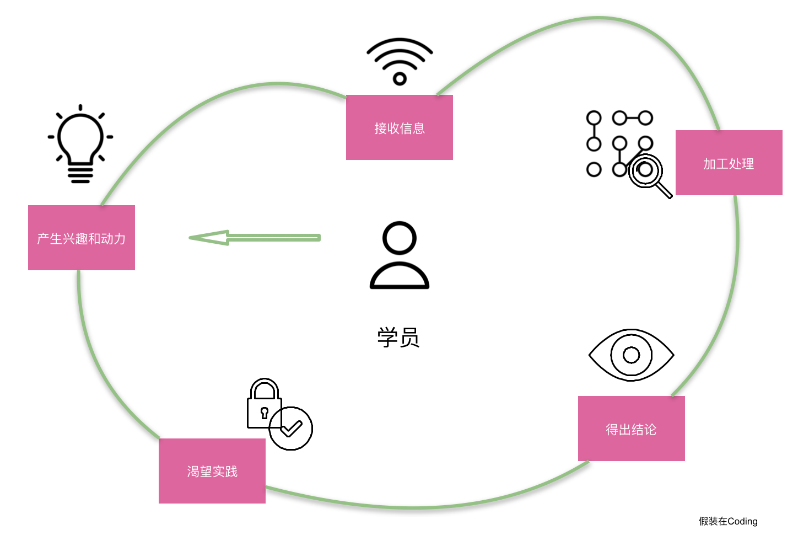

## 内容概要
- 闲聊: 在线培训为啥效果令人担忧
- 线上培训会遇到的问题
- 这些问题的本质时什么 - 学员视角支撑
- 学员的学习环和认知过程
- 在线授课的关键原则

疫情之下，优秀的人和事似乎都被放大了，如 [ 上海传染病专家](http://www.baidu.com/link?url=WiZNKeLaNdvapbu5xxjh23RrBLjVwT-cQqO9eJlTOy28H4xwjiC7A_g-GqySdCObY-w_vFHGO-yK_g5FTItF1FkeeeYMHpGovVGxWrTUQim)  张文宏，平时功底很厚，在防疫领域做的很扎实，目前在网上那是被全民热捧。但也能看到非常多平时就做的不到位的事儿更是被无限放大，大到无处躲避。不得不感叹一下，疫情就像是照妖镜（好想哪里不爽照哪里…），基本功是否扎实，照一照基本就能现原形。
 
今天，我们来聊聊想让线上培训能达到预期效果，会面对哪些问题？这些问题背后的本质是什么？据我的经验，解决了这些主要问题，培训质量至少能评80分，剩下20分如何做，请期待一下后续的文章。

最近很多公司和学校不得不改线下培训为线上培训，效果自然是不用说，大多都很惨。总的来说惨的里面存在两种情况：
* 一种是同样的培训在线下本就做的不够扎实，放线上就好似罩了一个照妖镜，很多问题都显现出来了；

* 另一种是把线上培训当成网红直播一样，是个课就往线上放，只要我肚子里有货，期待着把货推出去了，听课的学员好像就都能理解似得；

 
以上两种情况都只能得到一种培训结果：听天由命！其形式基本与播新闻是类似的，但是写新闻的编辑可是学过传播学的，一听就知道短短的新闻要让观众感兴绝对不简单。但让学员连着看一天，甚至几天的新闻，我想还是会比较难受的。
 
## 线上培训会遇到的问题
 
最近和不少朋友和客户都在讨论线上培训怎么做，大家对线上培训的效果多多少少都持有怀疑的态度，但基本都是主观感觉或一些外在可见现象的担心，很难能说出效果不好的本质问题是什么。
 
通过我的观察，发现很多效果差的培训基本都会存在以下的问题：
 
●  	对培训有不切实际期望

这几年我在IT领域做人才赋能，包括初，中级人员软件开发能力培养，高级人员的软件架构设计，以及敏捷，DevOps等相关理念和实践的培训。大部分培训的参与者和组织方都认为通过2天，甚至1天的培训，学员应该学会…  能在工作中…等，我通常会直接告诉对方，短短几天的在线培训不能让学员会什么，其实原因有很多，大家可以回忆下自己参加过的培训，有哪一项技能是你在培训中学会的？ 我觉得最重要的两个原因是 ：1. 时间太短，练习量不够； 2.脱离真实场景，精心设计的培训，距离在实际中应用还存在一段爬坡上坎，掉坑里的过程。

●  	学员学习时不专心，同时做了其它事儿

这里面存在很多中情况，学员不专心不一定是学员的态度问题，也有很大一部分是因为授课过程无法吸引他，或者是在处理紧急工作。更重要的是我们很难隔着屏幕发现他是否在认真跟课。

●  	学员听了很多道理，眼睛会了，手不会

这个是很多培训的通病，几百页的PPT，都可以写成书了。纸上谈兵终觉浅，没有给学员充足的练习机会，即时再丰富，前沿的内容，也很难帮助学员落地。虽然我相信很多培训是能给学员启发的，甚至醍醐灌顶的观点，但依然是一件投入产出比很低的事儿。

●  	老师讲了很多自己体系化内容，但不知道学员是否理解

这个也是一个我可以举出无数案例的问题，我不否认老师的知识体系很棒，但往往在培训的时候很自然的就带上了专家的帽子，再加上对着屏幕讲，基本就进入了录音模式。现实中我把这叫做自嗨,自己感觉讲的行云流水，学员连问题都还提不出来…

●  	学员不敢提问

这是对于大多数学员都存在的问题，怕犯错，怕出丑，但是一旦发现大家都和自己一样存在困惑，便也就不会不敢了。

●  	老师问的问题  =  没有问问题

很多培训中，老师的提问完全遵循以下的套路： 大家有没有问题？大家理解了吗？….  这种提问本身属于封闭式问题，用对了场景还是不错的，但我观察到的是一天的培训，每个主题完了，就会照此问一下。而且现场大多数情况是无人应答，很快就进入下一个主题。

●  	老师抛出了很多新概念，感觉自己更晕了

一些培训中，老师为了讲明白一个概念，用了更多学员不知道的名词，此时学员基本是问题都不知道改如何提。当然有时遇到比较较真的学员，会直接站起来说：“老师你能给我说说这个概念是什么吗？ 刚你讲了那么久，我完全听不懂”。这种尴尬的场面一旦出现，这次的培训很可能就废了。

●  	从众效应，导致学员隐瞒真实反馈

线简单介绍下”阿希从众实验“：6个志愿者，5个托儿。画有一条线的卡片，让志愿者判断它另一张卡片上的三条线的哪一条等长。这5有个托儿故意异口同声的说出错误答案，于是许多志愿者开始迷惑，最后的结果是，75%的志愿者被带偏，至少做了一次从众的错误判断。应该能差到我想表达什么了吧？ 当老师说：“听懂了的同学请举手”，只要有一部分人快速举手了，最后的结果往往是所有人都举手了（假设一个培训班的人数在30人左右）
 
## 问题的本质
 从上面的问题和现象来分析，排除第一个仅仅只需要勇气来面对。其它的问题从本质上来看基本可以归为：
●  	老师缺乏学员视角
●  	学员注意力难以管理
●  	学员与老师双向反馈缺失或延迟
●  	学员练得太少，听得太多
 
从这几个问题的本质出发，我们再来看看线上培训会遇到的问题其实与线下培训是一样的，但是信息传递的信道改变了，学员与老师，学员与学员都没法面对面及时沟通互动，所以也加大了注意力管理和反馈获取的难度。再给出解决办法之前，我们先一起看看学员是如何学习的？
 
## 学员是如何学习的？
 

 

从上图的学习环来看，学员无论学习什么知识，都会有一个兴趣或动力推着他开始学习；接着便会开始找各种资料书籍；然后按自己的理解去加工处理这些知识，初步消化；再接着思考总结，形成自己能够理解的概念或得出结论；最后就是跃跃欲试的想付诸实践和尝试。
 
下图，针对学员学习过程的五个关键节点，我们都应该设计对应的教学步骤，在培训中帮助学员尽可能多的完成学习的闭环，建立起未来在实际场景中去落地的台阶。（其中推动实践发生，更多指培训中的学员练习）
 

基于如上的思考，我们是否可以得出一个假设？只要学员能流畅的完成一个个学习环，那么就能够理解培训课中所传达的知识或实践，并能获得后续自己去持续学习和尝试的基础。答案是不一定，但是从单个环的角度出发，是没问题的。因为一旦设计多个环，就会涉及到学员连续性学习设计的问题，这需要我们去构建“流”式的学习/练习过程（期待下后续的文章吧）。
 
## 在线授课的关键原则
 
前面铺垫了这么多，其实最重要点已经告诉大家了，如果理解了问题，知道了做在线培训所面临的未知是什么，办法应该会有很多，我在这里给一个我最喜欢的方式，很简单几个字：练习驱动教学。通过精心设计的练习，让学员通过做中学的方式，逐步把未知的知识转化为自己脑中有画面感的概念/实践/技能，并持续通过练习来呗强化和增量的拓展。
 
针对咱们要解决的培训问题的本质，希望以下我总结的原则能够给你带来启发
 
### 在线培训适用9原则

* 经过考验的工具：多人视频软件(通话质量，多个房间，桌面分享（屏上做标记），录屏)，多人协作软件（实施画图，写字），keynoye/ppt（展示提前准备的内容，简单图形画图）

*   创造学习阻力：让学员经历躺坑  → 独立思考/理解-> 解决问题 → 实验->  总结 的过程，自己的出结论

*   小步教学，控制变量单一：当教授/学员练习某一知识时，确保不会有其它新的概念和知识出现在这个过程中

*  场景迁移：演示一个场景，让学员练习另外一个场景

*  防止自嗨行为：与学员能学什么相比，自己要讲什么一点儿也不重要

*  创造学员即时反馈：不要灌输，要时刻知道学员学的如何，有什么问题，才能针对性的进行适应性教学

*  防止从众效应：设置阶段性的 具体的问题，真实反应学员状态

*  实时评估：  评估不一定需要试卷，精心设计的问题和小调查，都是评估当前学员学习情况的好办法，不要蒙着眼睛教学

*  速度分层：针对教学内容，教学的量和速度需要区分：

	1. 专用工具 技术 概念和原则  -  此层知识的迭代速度很快，帮助学员理解， 能上手应用即可；

	2. 技能和态度  -  此层变化速度较慢，一般是一些底层的基本能力，帮助学员锻炼肌肉记忆 ，形成条件反射 ；

	3. 基础结构（文化，核心价值观&人格特质）-   此层基本不变，主要是设计一个人底层的 思考框架 认知方法 做事风格，很难通过短期培训获得，需要考虑大环境的影响；

 
## 最后
爱因斯坦如是说道：“提出一个问题往往比解决一个问题更重要，因为解决问题也许仅能是一个数学上或实验室上的技能而已。而提出新的问题、新的可能性，从新的角度去看旧的问题，都需要有创造性的想象力，而且标志着科学的真正进步。”
 
当然我的观点，可能离科学的真正进步还差很远，但也期望能促进行业的进步，知识消费的时代，随处可见的知识平台都正在变成各种知识搜索引擎，泛泛而谈的知识培训，只能是广撒网，难以深入。我期望它们能够让学员具备开始实践的属性，帮助学员解决实际问题，给方法，聊细节，并推动学员持续学习和落地。
 
这是我第一次尝试分享非IT技术类的观点，文章的9个原则，每一个都可以展开来说，如果你觉得有帮助，我会在之后的文章中一一道来。